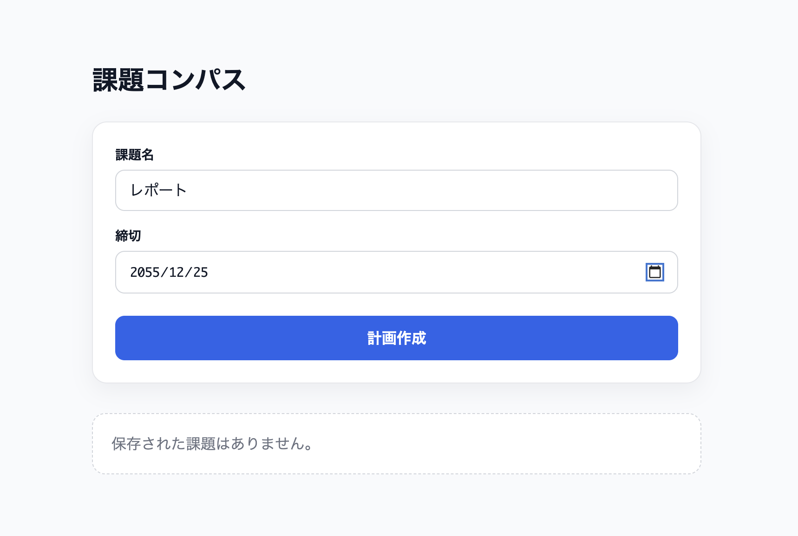
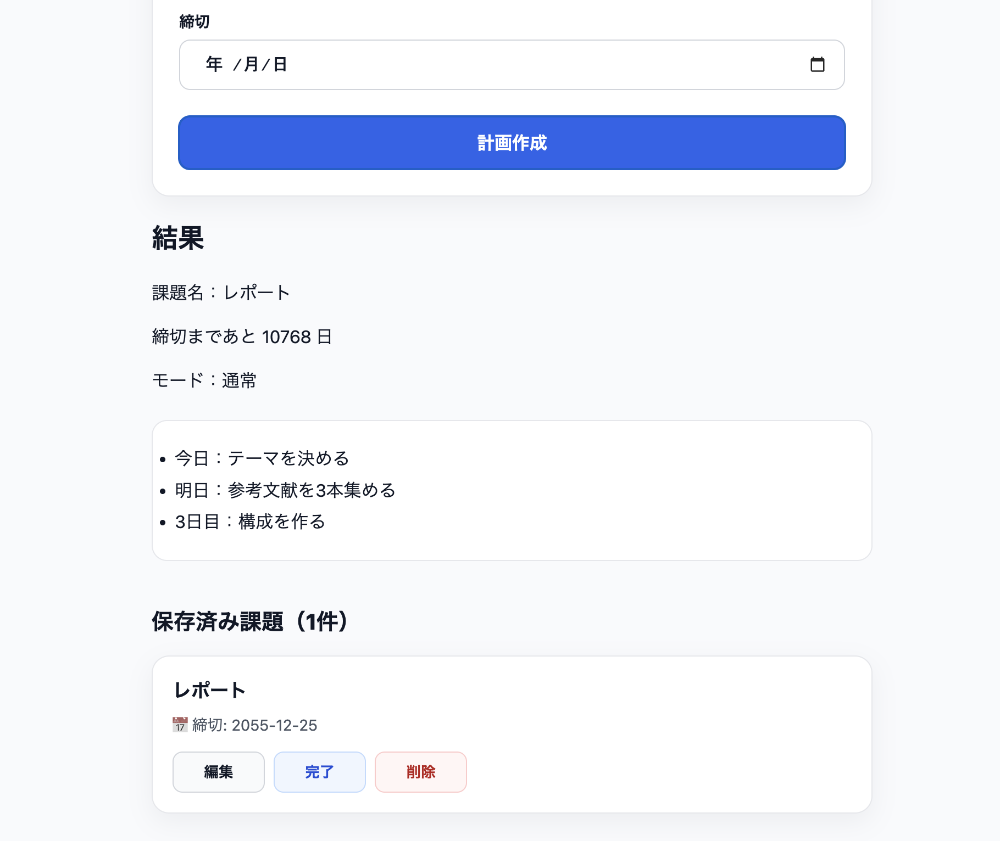
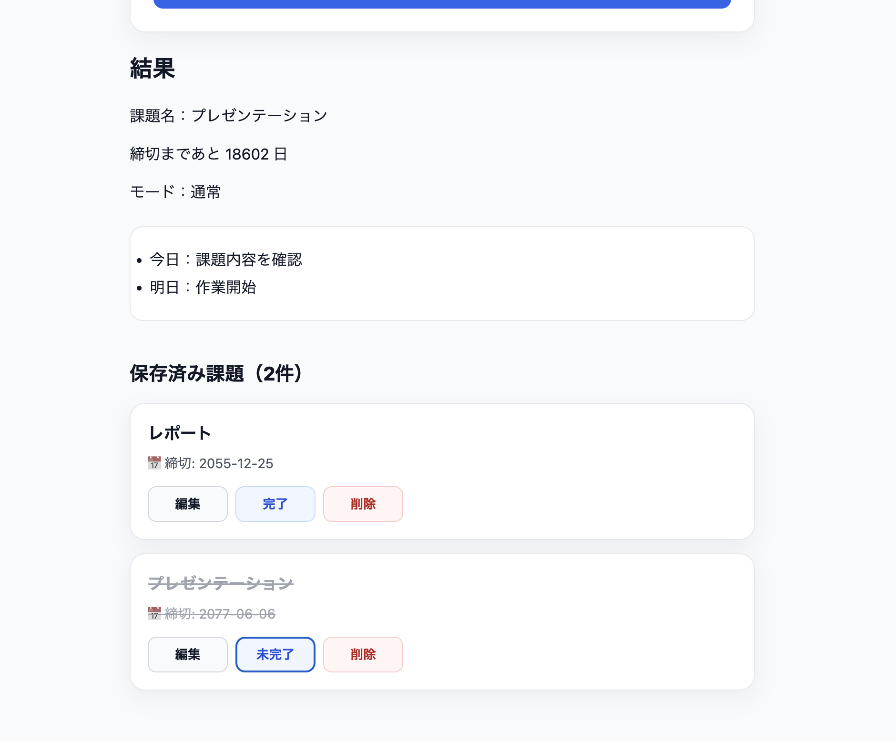

# 📚 課題コンパス (Task Assistant)

課題コンパスは、**大学生向けの学習計画作成Webアプリ**です。

課題名と締切日を入力するだけで、締切までの日数を計算し、
「今日やるべきこと」を分かりやすく提案します。

---

## 🌐 Demo

https://task-assistant-weld.vercel.app/

---
## 📸 Screenshots

### Home



### Task Created



### Completed Task



---

## 📖 背景

大学生活では、

- レポート
- プレゼン
- プログラミング課題
- 実験レポート

など、複数の課題を同時に管理する必要があります。

しかし、多くの学生は

- 締切直前まで着手できない
- 作業量が分からない
- 何から始めればよいか分からない

という問題を抱えています。

そこで、

**締切から逆算した学習計画を自動生成するアプリ**

として開発しました。

---

# ✨ 主な機能

## 課題管理

- 課題の作成
- 課題一覧表示
- 課題の編集
- 課題の削除
- 完了状態の切り替え

## 学習計画

- 締切までの日数を自動計算
- レポート向け学習計画生成
- 発表向け学習計画生成
- 緊急モード（締切3日以内）

## データ管理

- LocalStorageによるデータ保存
- ページ更新後もデータ保持

## UI

- レスポンシブ対応
- ライトテーマ
- カードUI

---

# 🛠 使用技術

| 技術 | 用途 |
|------|------|
| Next.js | フロントエンド |
| React | UI構築 |
| TypeScript | 型安全性 |
| CSS Modules | スタイリング |
| Vercel | デプロイ |

---

# 📂 ディレクトリ構成

```
task-assistant
├── app
├── components
├── lib
├── public
├── tests
├── types
├── package.json
└── README.md
```

※現在リファクタリングを進めながら保守性を改善しています。

---

# 🚀 セットアップ

```bash
git clone https://github.com/kippeicreator/task-assistant.git

cd task-assistant

npm install

npm run dev
```

ブラウザで

```
http://localhost:3000
```

を開いてください。

---

# 🎯 ロードマップ

## ✅ Version 0.1 Foundation

- コンポーネント分割
- 型設計
- テスト導入

## ✅ Version 0.2 MVP

- LocalStorage
- 課題CRUD
- 完了機能
- UI改善

## 🚧 Version 0.3

- Database
- Prisma
- SQLite
- API

## 📅 Version 0.4

- Authentication

## 📅 Version 0.5

- AI学習計画

## 📅 Version 1.0

- 正式リリース


---

# 🧠 このプロジェクトで学んだこと

- Next.js App Router
- Reactによる状態管理
- TypeScript
- Git / GitHub
- Vercelへのデプロイ
- UI/UX設計
- コンポーネント設計
- CSS Modules
- LocalStorage
- GitHub Issues / Projects / Milestones
- Vitestによるユニットテスト

---

# 🔧 今後改善したいこと

現在はMVP（Minimum Viable Product）として実装しています。

今後は

- UIとビジネスロジックの分離
- 型設計の改善
- テストカバレッジ向上
- パフォーマンス最適化
- アクセシビリティ改善

などを行い、
保守性・拡張性の高いアプリケーションへ改善していく予定です。

---

# 📈 開発方針

このプロジェクトでは

- 読みやすいコード
- 保守しやすい設計
- 小さく改善を積み重ねること

を意識して開発しています。

また、Google Software Engineerを目標としているため、
設計・品質・テスト・Git運用まで含めて継続的に改善しています。

---

# 👤 Author

**Kippei Ishimaru**

GitHub

https://github.com/kippeicreator